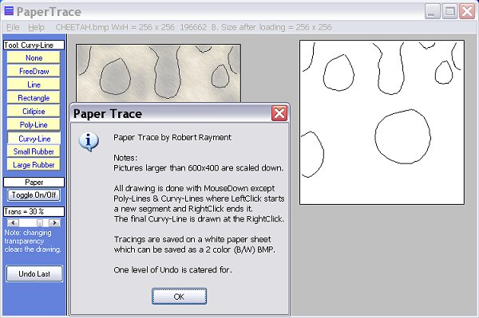



## Paper Trace \(Update 17 Aug\)

### Description

Paper Trace by Robert Rayment. This consists of an image sheet (Loaded image), a translucent tracing sheet(Faded image to draw on) and a white paper sheet (The actual tracing that can be saved as a 2 color(B/W) BMP). The screenshot explains more. To show the method I've kept it simple in that large pictures are scaled down, avoiding scrollng code. Zip 36 KB.

----

Update 10 Aug: LoadPicture Function simplified a bit.

----

Update 14 Aug: Removed XOR wipeout in finished drawing by saving draw coords. Corrected a FreeDraw error.

----

Update 17 Aug: Varying transparency does not now lose the drawing.
 
### More Info
 
Pictures

             |
---                |---
**Submitted On**   |2006-08-14 19:55:44
**By**             |[Robert Rayment](https://github.com/Planet-Source-Code/PSCIndex/blob/master/ByAuthor/robert-rayment.md)
**Level**          |Intermediate
**User Rating**    |4.6 (32 globes from 7 users)
**Compatibility**  |VB 6\.0
**Category**       |[Graphics](https://github.com/Planet-Source-Code/PSCIndex/blob/master/ByCategory/graphics__1-46.md)
**World**          |[Visual Basic](https://github.com/Planet-Source-Code/PSCIndex/blob/master/ByWorld/visual-basic.md)
**Archive File**   |[Paper\_Trac2014028172006\.zip](https://github.com/Planet-Source-Code/robert-rayment-paper-trace-update-17-aug__1-66216/archive/master.zip)

### API Declarations

A few, see code

